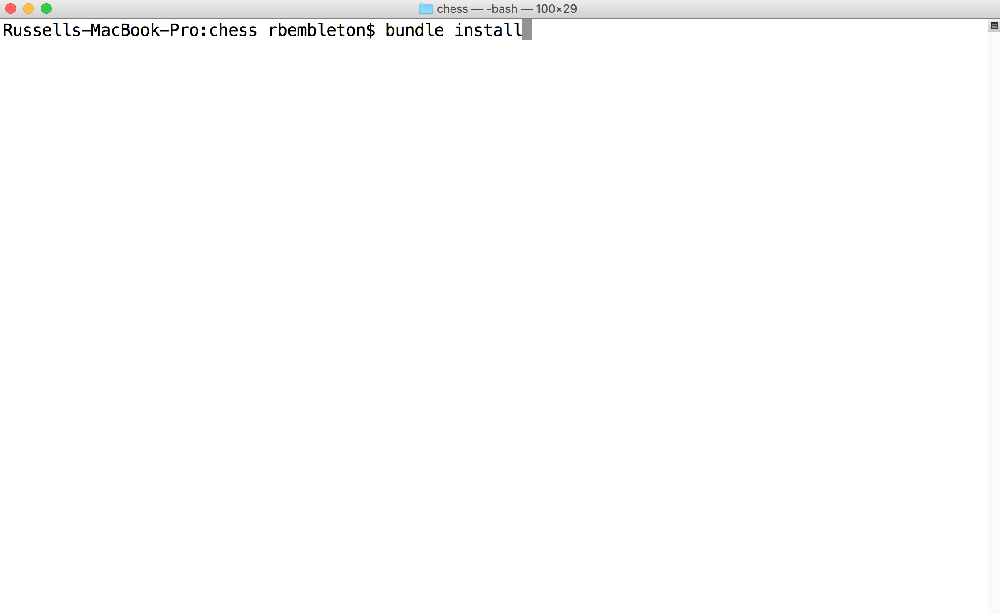
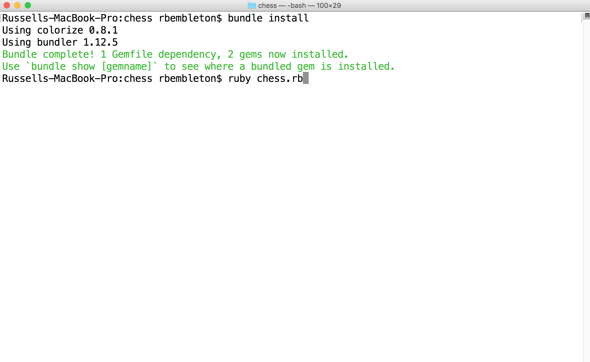
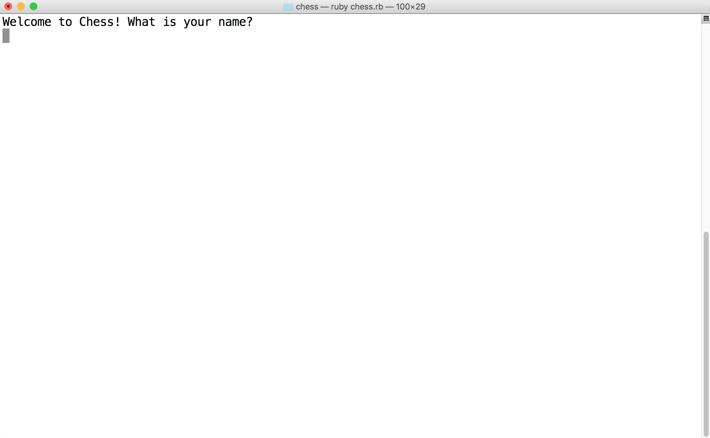
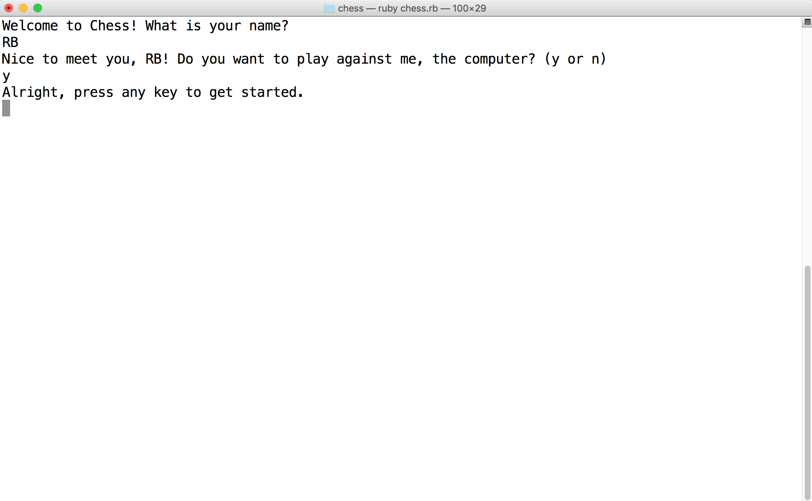
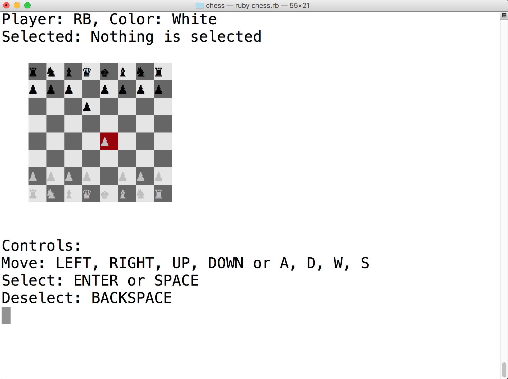

# Chess

This was started as a project in class with Mac, but expanded Solo to be fully functional, and include a computer AI.

This game features
- OOP
- class inheritance
- error handling
- computer AI
- DRY code

## Running Chess

1. First download the zip file [here](https://github.com/rbembleton/Chess/archive/master.zip)
2. Make sure Ruby is installed by running `ruby -v` in your console
  - If it isn't go to this [website](http://installrails.com/steps/choose_os) for installation instruction
3. Unzip and navigate to the folder using terminal
4. Run `bundle install` and then `ruby chess.rb`
5. Have fun! :D

## ...OK. That all sounds good... but could you walk me through it a bit more?

Sure! Here are some screenshots to help get you started:

`bundle install` - you should see the gem `colorize` install

`ruby chess.rb` - if this doesn't work check your Ruby version with `ruby -v` and make sure it is 2.0 or higher

Welcome page - enter your name and specify if you'd like to play against the computer AI or a friend

Who needs friends when you have a computer to play Chess against?!

Follow the on screen controls to navigate, and enjoy!
(For optimal game play zoom in using ⌘+)

